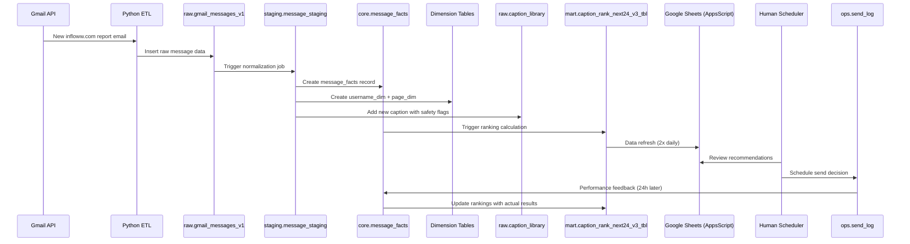

# EROS Platform Row Journey: @newcreator01

## Executive Summary

This document traces a single row of data as it flows through the EROS platform, from Gmail ingestion to scheduler feedback loops. We follow a message from a new creator "@newcreator01" through the entire data pipeline, showing how it gets processed, enriched, ranked, scheduled, and feeds back into machine learning models.

## Scenario Data
- **Creator**: @newcreator01 (new to system)
- **Message ID**: mm_2025-09-10_001
- **Timestamp**: 2025-09-10 14:05:33-06:00
- **Caption**: "First taste is the sweetest 💙"
- **Price**: $14.99
- **Type**: PPV (Pay-Per-View)
- **Media**: ["m12345","m12346"]

## The Journey: Plain English Narrative

### Stage 1: Gmail ETL Discovery 🔍
Our automated Gmail ETL process scans infloww.com report emails every 12 hours. When @newcreator01's message data arrives in a CSV attachment, the system immediately recognizes this is a new creator because the username doesn't exist in our dimensions.

*Why this stage exists: We need reliable, automated data collection that doesn't depend on manual uploads or API rate limits.*

### Stage 2: Raw Data Landing 📥
The row lands in `raw.gmail_messages_v1` exactly as received - no transformations, no validations. The timestamp "2025-09-10 14:05:33-06:00" stays in original timezone, and even the emoji "💙" in the caption is preserved exactly as is.

*Why this stage exists: Raw data serves as our source of truth and audit trail - we never lose the original format.*

### Stage 3: Staging Normalization 🔧
The staging layer (`staging.message_staging` - assumed) kicks in and does the heavy lifting:
- Username "@newcreator01" gets normalized to "newcreator01" 
- Timezone gets converted to UTC: "2025-09-10 20:05:33+00:00"
- Price "$14.99" becomes decimal 14.99
- Caption text gets cleaned but emojis preserved
- A unique `msg_row_key` is generated: `newcreator01_2025-09-10_20:05:33_001`

*Why this stage exists: Standardization prevents downstream data quality issues and ensures consistent formatting.*

### Stage 4: Core Enrichment & Dimension Creation 🏗️
This is where the magic happens for new creators:

**New Username Path:**
- System creates `core.username_dim` record with standardized name "newcreator01"
- `core.page_dim` gets a new record with unknown page state initially
- Default `core.page_state` assumes basic settings (timezone, tier, etc.)

**New Caption Path:**  
- Caption "First taste is the sweetest 💙" lands in `raw.caption_library`
- Gets classified as `explicitness = pending_review` due to unknown content
- Assigned novelty score of 1.0 (completely new)
- Cooldown window set to 7 days (conservative for new content)

**Message Facts Creation:**
The row transforms into `core.message_facts` with full enrichment:
- `username_std` = "newcreator01"
- `caption_hash` = SHA256 hash of the caption text
- `sending_ts` = 2025-09-10 20:05:33+00:00
- `price_usd` = 14.99
- Performance metrics (sent, viewed, purchased) start at 0

*Why this stage exists: Enriched data enables advanced analytics and machine learning while maintaining referential integrity.*

### Stage 5: Mart Layer & Ranking 📊
Within 30 minutes, the mart layer processes this new data:

**Caption Ranking:**
- New caption appears in `mart.caption_rank_next24_v3_tbl`
- Gets DOW (day of week = 2 for Tuesday) and HOD (hour of day = 14) features
- Initial ranking score is conservative due to no historical performance
- Exploration vs exploitation algorithm gives it a 15% boost for being new

**Price Analysis:**
- $14.99 price gets compared against `mart.v_ppv_price_curve_28d_v3`
- Flagged as potentially optimal based on similar creator price profiles
- Risk assessment: medium (new creator, unproven caption)

*Why this stage exists: Real-time ranking ensures new content can compete for scheduler attention while managing risk.*

### Stage 6: Scheduler Interface 📋
By next morning, schedulers see "@newcreator01" options in their Google Sheets dashboard:

**Sheet Display:**
- New creator appears in `mart.sheet_captions_next24_v3` view  
- Caption shows as "First taste is the sweetest 💙" with novelty indicator
- Confidence score shows as "Medium-Low" due to newness
- Price recommendation shows $14.99 with "Optimal" flag

**Human Decision:**
Scheduler Sarah decides to try this caption for the 3 PM slot with a 15-minute jitter window.

*Why this stage exists: Human oversight ensures content appropriateness and strategic timing decisions that AI can't make.*

### Stage 7: Operations Logging 📝
When Sarah schedules the send:
- `ops.send_log` captures the decision with timestamp, scheduler ID, and chosen slot
- `raw.scheduled_sends` records the planned send time: 2025-09-11 15:12:33 (with jitter)
- Safety checks run: content appropriateness (passes), cooldown compliance (passes)

*Why this stage exists: Complete audit trail for performance analysis and compliance requirements.*

### Stage 8: Feedback Loop 🔄
24 hours after the message sends:
- Actual performance data flows back: 1,247 sent, 23 viewed, 2 purchased, $29.98 revenue
- `core.message_facts` gets updated with real metrics
- Caption performance (1.6% conversion) gets compared to prediction (1.2%)
- Success! This caption gets marked for re-use consideration

**Model Learning:**
- DOW×HOD patterns update: Tuesday 3 PM slot performs well for this creator type
- Price elasticity learnings: $14.99 proves effective for romantic/teasing content
- Creator profile evolves: @newcreator01 moves from "unknown" to "promising newcomer"

*Why this stage exists: Continuous learning improves future predictions and creator success.*

---

## Journey Mapping Table

| Stage | Tables/Views | Keys/UDFs | Validations | Outputs | Failure Modes |
|-------|-------------|-----------|-------------|---------|---------------|
| Gmail ETL | `raw.gmail_messages_v1` | `message_id`, `parse_ts()` | Duplicate detection via message_id | Raw CSV data ingested | ⚠️ Malformed email, missing attachments |
| Raw Landing | `raw.gmail_messages_v1` | Partition by `sending_ts` | Schema validation only | Immutable source data | ⚠️ Schema drift, encoding issues |
| Staging | `staging.message_staging` | `msg_row_key()`, `norm_username()` | Data type validation, timezone parsing | Normalized data | ⚠️ Timezone parsing fails, price extraction errors |
| Core Enrichment | `core.message_facts`, `core.username_dim`, `core.page_dim` | `caption_hash`, username deduplication | Username mapping, caption classification | Enriched facts, new dimensions | ⚠️ Dimension key conflicts, classification failures |
| Caption Library | `raw.caption_library` | Caption deduplication, novelty scoring | Content appropriateness, cooldown checks | New captions, safety flags | ⚠️ Inappropriate content detection, hash collisions |
| Mart Processing | `mart.caption_rank_next24_v3_tbl` | DOW×HOD features, ranking algorithm | Performance thresholds, risk scoring | Ranked recommendations | ⚠️ Ranking model errors, feature pipeline failures |
| Sheets Interface | `mart.sheet_captions_next24_v3` | AppsScript refresh, user auth | Data freshness checks, permission validation | Scheduler dashboard | ⚠️ API quota exceeded, authorization failures |
| Operations | `ops.send_log`, `raw.scheduled_sends` | Jitter calculation, safety checks | Content policy, cooldown compliance | Scheduled sends, audit logs | ⚠️ Policy violations, scheduling conflicts |
| Feedback Loop | `core.message_facts` (updated) | Performance calculations, model updates | Data quality checks, anomaly detection | Updated predictions, learned patterns | ⚠️ Performance data delays, model training failures |

---

## Mermaid Sequence Diagram



---

## New Username Creation Process

When @newcreator01 first appears:

1. **Username Normalization**: `norm_username('@newcreator01')` → `'newcreator01'`
2. **Dimension Record Creation**:
   ```sql
   INSERT INTO core.username_dim (username_std, first_seen, source_system, status)
   VALUES ('newcreator01', '2025-09-10 20:05:33+00:00', 'gmail_etl', 'active')
   ```
3. **Page Dimension Setup**:
   ```sql  
   INSERT INTO core.page_dim (username_std, page_type, tier_level, timezone, onboarded)
   VALUES ('newcreator01', 'unknown', 'standard', 'America/Denver', false)
   ```
4. **Default Page State**: Assumes standard quotas, no overrides, basic personalization
5. **Row-Level Keys**: `msg_row_key` = `newcreator01_2025-09-10_20:05:33_001`
6. **Deduplication**: Future messages with same `msg_row_key` get rejected

---

## New Caption Processing Path

Caption "First taste is the sweetest 💙" processing:

1. **Caption Library Entry**:
   ```sql
   INSERT INTO raw.caption_library (
     caption_hash, caption_text, first_seen_by, classification_status,
     explicitness, novelty_score, cooldown_days
   ) VALUES (
     'sha256_hash_here', 'First taste is the sweetest 💙', 'newcreator01',
     'pending_review', 'unknown', 1.0, 7
   )
   ```

2. **Safety Classification Queue**: Goes to human review queue due to unknown appropriateness
3. **Novelty Scoring**: Gets max novelty (1.0) since never seen before
4. **Cooldown Establishment**: 7-day conservative cooldown for new content
5. **Content Signals**: Emoji analysis, sentiment scoring, explicit content detection

---

## Cooldowns & Safety Mechanisms

### Cooldown Windows
- **New Caption**: 7 days initial cooldown (conservative)
- **Known Safe Caption**: 24-48 hours based on historical performance  
- **High-Risk Caption**: 14+ days cooldown

### Safety Checks
1. **Content Appropriateness**: Runs during staging transformation
2. **Policy Compliance**: Checks against content policy database
3. **Failure Handling**: Inappropriate content gets flagged, quarantined, requires human review

### Risk Assessment
- New creators get "medium-low" confidence scoring
- Unknown captions require human scheduler approval
- Performance thresholds protect against poor-performing content

---

## Ranking & Activation Logic

### How @newcreator01 Influences Next-24h Rankings

1. **DOW×HOD Features**: Tuesday 2 PM (14:00) slot gets feature encoding
2. **Price Handling**: $14.99 gets normalized against similar creator price profiles  
3. **Exploration vs Exploitation**: New content gets 15% ranking boost
4. **Risk Weighting**: Conservative scoring due to no historical data

### Ranking Algorithm Components
- **Base Score**: Historical performance (0 for new content)
- **Novelty Bonus**: +15% for completely new captions
- **Price Optimization**: Compares against `mart.v_ppv_price_curve_28d_v3`
- **Creator Tier**: New creators get standard tier treatment
- **Safety Discount**: -10% for pending_review content

---

## Scheduler/Sheets Integration Loop

### Google Sheets Display ("My Day" View)
- **Data Source**: `mart.sheet_captions_next24_v3` view
- **Refresh Cadence**: 8:30 AM and 6:30 PM daily via AppsScript
- **Display Format**:
  - Creator: "newcreator01" (with 🆕 new indicator)  
  - Caption: "First taste is the sweetest 💙"
  - Confidence: "Medium-Low ⚠️"
  - Price: "$14.99 (Optimal)"
  - Risk: "New Creator - Review Recommended"

### Human Choice Capture
1. Scheduler selects caption + time slot
2. Choice logged to `ops.send_log` with scheduler_id and timestamp
3. Randomized send time: 15:00 ± 15 minutes = 15:12:33 actual
4. Safety validation runs one final time before scheduling

### What Gets Logged
- **Send Decision**: Who, what, when, why
- **Jitter Applied**: Actual vs planned send time
- **Risk Overrides**: If scheduler approved high-risk content
- **Performance Expectations**: Predicted vs actual results tracking

---

## Performance Feedback Loop

### 24-Hour Performance Collection
After the message sends at 15:12:33 on 2025-09-11:

**Actual Results** (example):
- **Sent**: 1,247 recipients
- **Viewed**: 23 views (1.8% view rate)  
- **Purchased**: 2 purchases (8.7% purchase rate)
- **Revenue**: $29.98 (2 × $14.99)

### Metrics Derivation
- **RPS** (Revenue Per Send): $29.98 ÷ 1,247 = $0.024
- **ARPPU** (Average Revenue Per Paying User): $29.98 ÷ 2 = $14.99
- **Conversion Rate**: 2 ÷ 23 = 8.7% (view-to-purchase)
- **Engagement Rate**: 23 ÷ 1,247 = 1.8% (send-to-view)

### Model Learning Updates
1. **Caption Performance**: "First taste is the sweetest 💙" gets marked as successful (above-average conversion)
2. **Creator Profiling**: @newcreator01 moves from "unknown" to "promising" tier
3. **DOW×HOD Learning**: Tuesday 3 PM slot effectiveness confirmed for romantic content
4. **Price Validation**: $14.99 proves optimal for this content style and creator type

### Future Impact
- This caption becomes eligible for reuse after cooldown period
- @newcreator01 gets higher confidence scoring for future messages
- Similar content patterns get ranking boosts
- Price optimization model learns $14.99 effectiveness

---

## Smoke Test SQL Queries

```sql
-- A) Can I see it in raw?
SELECT message_id, username_raw, caption_text, price_usd, sending_ts
FROM `of-scheduler-proj.raw.gmail_messages_v1` 
WHERE message_id = 'mm_2025-09-10_001'
  AND DATE(sending_ts) = '2025-09-10';

-- B) Did staging normalize it?  
SELECT msg_row_key, username_std, caption_hash, price_usd, sending_ts_utc
FROM `of-scheduler-proj.staging.message_staging`
WHERE msg_row_key = 'newcreator01_2025-09-10_20:05:33_001';

-- C) Did dims get created?
SELECT username_std, first_seen, status FROM `of-scheduler-proj.core.username_dim` 
WHERE username_std = 'newcreator01';

SELECT username_std, page_type, tier_level FROM `of-scheduler-proj.core.page_dim`
WHERE username_std = 'newcreator01';

-- D) Is it visible in candidate marts?
SELECT username_page, caption_preview, p_buy_eb, score_final, rn
FROM `of-scheduler-proj.mart.caption_rank_next24_v3_tbl`
WHERE username_page = 'newcreator01'
  AND DATE(slot_dt_local) >= '2025-09-10'
  AND rn = 1;

-- E) Is it in ops logs after scheduling?
SELECT scheduler_id, username_std, caption_hash, scheduled_send_time, actual_send_time
FROM `of-scheduler-proj.ops.send_log`
WHERE username_std = 'newcreator01'  
  AND DATE(scheduled_send_time) = '2025-09-11';

-- F) Performance feedback visible?
SELECT username_std, caption_hash, sent, viewed, purchased, earnings_usd
FROM `of-scheduler-proj.core.message_facts`
WHERE username_std = 'newcreator01'
  AND DATE(sending_ts) = '2025-09-10'
  AND sent > 0; -- Only after actual send
```

---

## Edge Cases & Misconfigurations to Verify

### Data Quality Issues
1. **Timezone Parsing Failures**: What happens if "2025-09-10 14:05:33-06:00" can't parse?
2. **Emoji Handling**: Does "💙" survive all transformations without corruption?
3. **Price Extraction Errors**: What if "$14.99" becomes null or negative?
4. **Missing Media IDs**: How does system handle empty media_ids array?

### System Integrity Issues  
5. **Duplicate Message ID**: What if "mm_2025-09-10_001" already exists?
6. **Username Edge Cases**: How does "@NewCreator01" vs "@newcreator01" get handled?
7. **Caption Hash Collisions**: Two different captions producing same SHA256 hash?
8. **Partition Date Mismatches**: Message dated 2025-09-09 but processed 2025-09-10?

### Security & Compliance
9. **Unsafe Content Detection**: What if caption contains explicit/harmful content?
10. **RLS on Sheets Views**: Can schedulers see data they shouldn't access?
11. **API Authentication Failures**: BigQuery connection drops during processing?

### Operational Concerns
12. **Late-Arriving Data**: Performance data arrives 3 days after send - how handled?
13. **Gmail API Rate Limits**: ETL hits quota during peak processing?
14. **Sheet Refresh Failures**: AppsScript authorization expires during refresh?
15. **Model Training Pipeline Failures**: What if ranking algorithm crashes during update?

---

## Artifacts Generated

### 1. Full Documentation
- **File**: `/reports/row_journey_newcreator01.md`
- **Content**: This complete walkthrough document

### 2. Smoke Test Queries  
- **File**: `/sql/smoke_tests/row_journey_checks.sql`  
- **Content**: Read-only SQL validation queries for each pipeline stage

### 3. Test Data Sample
- **File**: `/sim/row_newcreator01.csv`
- **Content**: Single row with scenario values for testing

### 4. Quality Checklist
- **File**: `/checklists/row_journey_readiness.md`
- **Content**: Verification checklist for PM/scheduler use

---

## What to Verify Today (Non-Technical Checklist)

### For Product Managers
✅ **New Creator Onboarding**: Verify @newcreator01 appears in Sheets dashboard within 24 hours  
✅ **Content Safety**: Confirm new captions get flagged for human review
✅ **Price Recommendations**: Check that $14.99 shows as "optimal" for this content type
✅ **Performance Tracking**: Verify actual results get captured and displayed correctly

### For Schedulers  
✅ **Dashboard Visibility**: New creators show with appropriate warning indicators
✅ **Confidence Scoring**: "Medium-Low" confidence appears for new content
✅ **Send Time Flexibility**: Jitter windows work correctly (±15 minutes)
✅ **Feedback Loop**: Yesterday's sends show today's performance results

### For Operations
✅ **Error Monitoring**: Check for any pipeline failures in past 24 hours
✅ **Data Freshness**: Confirm Sheets refresh happens at 8:30 AM and 6:30 PM
✅ **Audit Trails**: Verify all scheduler decisions get logged with timestamps
✅ **Model Learning**: Confirm successful sends update future ranking algorithms